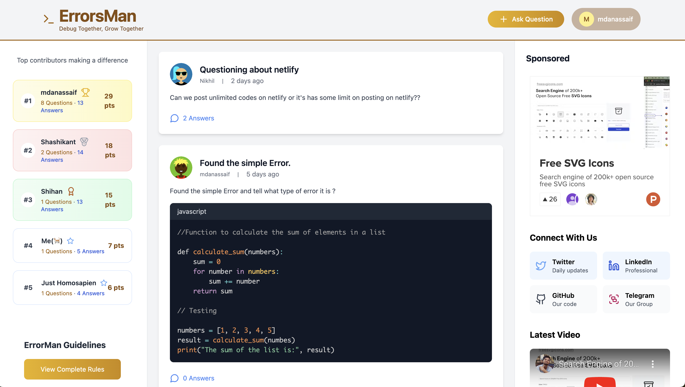

# ErrorsMan: Debug Together, Grow Together  

ErrorsMan is a collaborative debugging and learning platform aimed at creating a community where developers can debug problems together and grow their knowledge base collectively.  

## Demo  

  

_Check out the live application:_ [ErrorsMan Demo](https://errors-man.vercel.app/)  

---

## Available Plugins  

ErrorsMan supports the following official plugins:  

- **[@vitejs/plugin-react](https://github.com/vitejs/vite-plugin-react/blob/main/packages/plugin-react/README.md)**: Uses [Babel](https://babeljs.io/) for Fast Refresh.  
- **[@vitejs/plugin-react-swc](https://github.com/vitejs/vite-plugin-react-swc)**: Uses [SWC](https://swc.rs/) for Fast Refresh.  

---

## Contribute  

We welcome contributions! Here's how you can contribute:  

1. **Report Bugs**  
   Found a bug? Open an issue in the GitHub repository with details and steps to reproduce.  

2. **Suggest Features**  
   Got an idea? Open a feature request in the issues tab.  

3. **Submit Pull Requests**  
   Fork the repository, make your changes, and submit a pull request.  

4. **Community Discussions**  
   Join our community forums or Discord for discussions and collaboration.  

---

## How to Run the Project  

Follow these steps to set up ErrorsMan locally:  

### Step 1: Clone the Repository  

```bash  
git clone https://github.com/ErrorsMan/errorsman-community.git  
cd errorsman-community  
```  

### Step 2: Install Dependencies  

```bash  
npm install  
```  

### Step 3: Start the Development Server  

```bash  
npm run dev  
```  

The application will be running on [http://localhost:3000](http://localhost:3000). Open it in your browser to see the app in action.  

---

## Connect  

**Creator**: Follow [@creator_handle](https://twitter.com/creator_handle) on Twitter for updates and insights.  

---

We look forward to growing ErrorsMan with your help! Together, we debug. Together, we grow.  